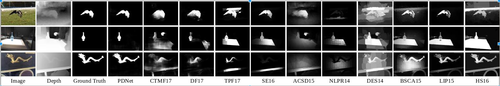

# PDNet
For RGBD salient object detection, the paper has benn accepted at icme2018 and the paper link is [here](https://arxiv.org/abs/1803.08636)


### The pre_trained model
Baidu Yun: https://pan.baidu.com/s/1rGXSTxtU8iNQa7FPGP83Wg password: 9hbq

Google drive: https://drive.google.com/open?id=18yXaBAeG_6qFuk4wyViSWiEXog5ctabM

The pre-trained model based on MSRA10k and DUTS-TR datasets, which contain about 20k pictures.


### Train
Download the dataset, for example, [MSRA10k](http://mmcheng.net/zh/msra10k/), and run the preprocess script
```
python preprocess.py
```

then run
```
python train.py
```

### Test 
Download the pre-trained model and the test picture, run
```
python test.py
```

### The results

